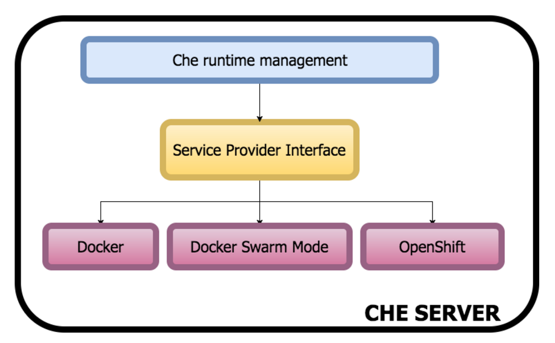
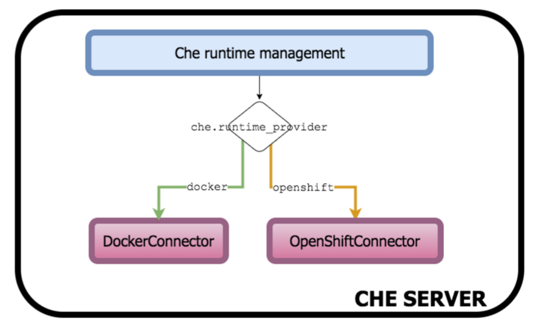

= Openshift Connector for Eclipse Che

Plan:

1) Provide PR with initial OpenShift connector implementation to Che 

2) Implement all OpenShift connector methods

3) Define SPI





4) Refactor OpenShift Connector for using SPI

NOTE: working on item *3* could start before *2* is completed. 

NOTE: Epic jira for the *1st* item from the plan - https://issues.jboss.org/browse/CHE-26[Use K8S API to create Che workspaces]

== Workflow

Currently all initial OpenShift & Che integration work is happening in Mario's fork - https://github.com/l0rd/che  
First thing, make sure that you can build `openshift-connector` branch:

```
cd che/

git remote add mario git@github.com:l0rd/che.git
git fetch mario openshift-connector:openshift-connector
git checkout openshift-connector

mvn -Dskip-enforce -Dskip-validate-sources -DskipTests -Dfindbugs.skip -Dgwt.compiler.localWorkers=2 -T 1C -Dskip-validate-sources clean install
```

NOTE: For now PRs are expected to be provided against `openshift-connector` branch

== How to deploy Eclipse Che on Minishift ?

Pre-requirements:

- OpenShift CLI (`oc`) - `v1.2.2` and above
- Minishift (`minishift`) - `v0.9.0` and above

First 4 steps are identical to the ones described in https://github.com/l0rd/openche#deployment-of-che-on-minishift[Deployment of Che on Minishift] document. 


== Debugging Che on Minishift
