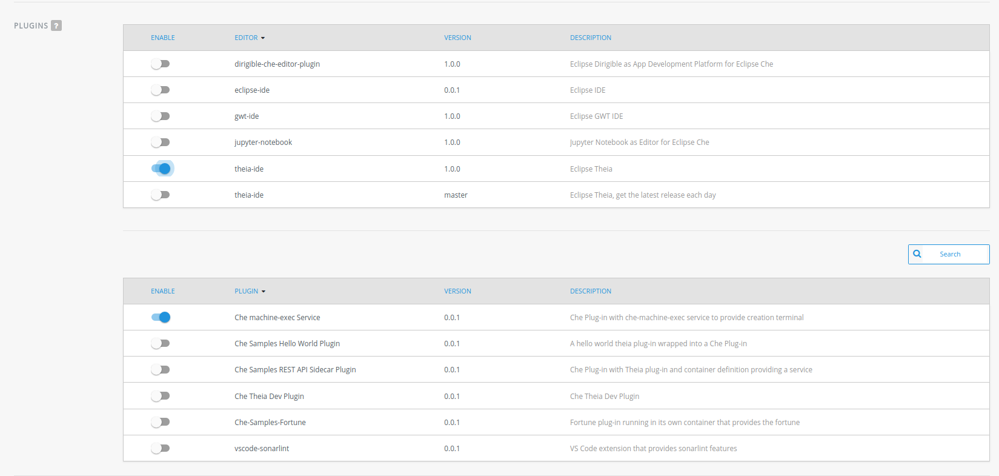
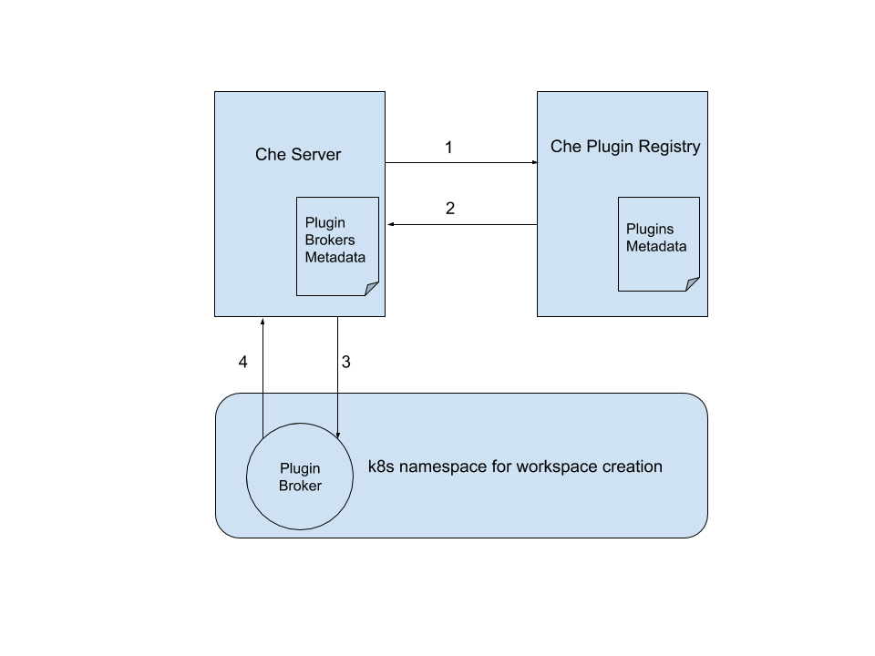
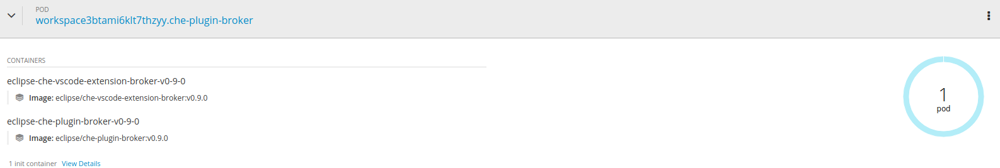
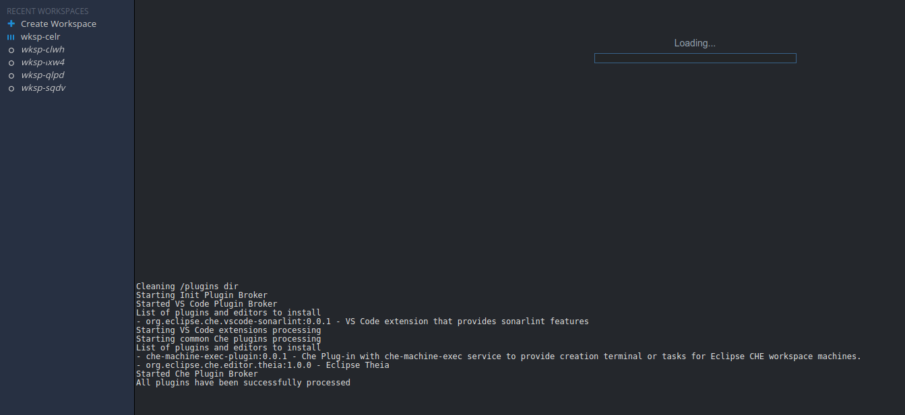

= Architectural insights about the plugin brokers

== Existing types of plugins

Before diving into the plugin broker concept, it really worth to briefly summarize the existing types of plugins which are currently supported in Che:

* Che Editor Plugin
** provides an editor / IDE running as a sidecar e.g. `Theia`, `Dirigible`, `Jupyter Notebook` etc.
* Che Plugin
** sidecar container which provides additional functionality e.g  `che-machine-exec-plugin` (provides terminal capabilities)
* VS Code extension Plugin
** sidecar container (can be also run in the main theia container) which provides functionality of an existing vscode extension e.g. https://www.sonarlint.org/vscode/[sonarlint]
* Theia Plugin
** sidecar container (can be also run in the main theia container) which extends functionality of the che-theia editor

== Plugin registry

All the plugins are available via the plugin registry - a standalone service which provides the metadata of the available plugins:

.plugins.json
[source,json]
----
[
{
"id":"che-dummy-plugin","version":"0.0.1","type":"Che Plugin","name":"Che Samples Hello World Plugin","description":"A hello world theia plug-in wrapped into a Che Plug-in", "links": {"self":"/plugins/che-dummy-plugin/0.0.1/meta.yaml" }
}
,{
"id":"che-machine-exec-plugin","version":"0.0.1","type":"Che Plugin","name":"Che machine-exec Service","description":"Che Plug-in with che-machine-exec service to provide creation terminal", "links": {"self":"/plugins/che-machine-exec-plugin/0.0.1/meta.yaml" }
}
,{
"id":"che-service-plugin","version":"0.0.1","type":"Che Plugin","name":"Che Samples REST API Sidecar Plugin","description":"Che Plug-in with Theia plug-in and container definition providing a service", "links": {"self":"/plugins/che-service-plugin/0.0.1/meta.yaml" }
}
,{
"id":"org.eclipse.che.editor.dirigible","version":"1.0.0","type":"Che Editor","name":"dirigible-che-editor-plugin","description":"Eclipse Dirigible as App Development Platform for Eclipse Che", "links": {"self":"/plugins/org.eclipse.che.editor.dirigible/1.0.0/meta.yaml" }
}
,{
"id":"org.eclipse.che.editor.eclipseide","version":"0.0.1","type":"Che Editor","name":"eclipse-ide","description":"Eclipse IDE", "links": {"self":"/plugins/org.eclipse.che.editor.eclipseide/0.0.1/meta.yaml" }
}
,{
"id":"org.eclipse.che.editor.gwt","version":"1.0.0","type":"Che Editor","name":"gwt-ide","description":"Eclipse GWT IDE", "links": {"self":"/plugins/org.eclipse.che.editor.gwt/1.0.0/meta.yaml" }
}
,{
"id":"org.eclipse.che.editor.jupyter","version":"1.0.0","type":"Che Editor","name":"jupyter-notebook","description":"Jupyter Notebook as Editor for Eclipse Che", "links": {"self":"/plugins/org.eclipse.che.editor.jupyter/1.0.0/meta.yaml" }
}
,{
"id":"org.eclipse.che.editor.theia","version":"1.0.0","type":"Che Editor","name":"theia-ide","description":"Eclipse Theia", "links": {"self":"/plugins/org.eclipse.che.editor.theia/1.0.0/meta.yaml" }
}
,{
"id":"org.eclipse.che.editor.theia","version":"master","type":"Che Editor","name":"theia-ide","description":"Eclipse Theia, get the latest release each day", "links": {"self":"/plugins/org.eclipse.che.editor.theia/master/meta.yaml" }
}
,{
"id":"org.eclipse.che.samples.container-fortune","version":"0.0.1","type":"Theia plugin","name":"Che-Samples-Fortune","description":"Fortune plug-in running in its own container that provides the fortune", "links": {"self":"/plugins/org.eclipse.che.samples.container-fortune/0.0.1/meta.yaml" }
}
,{
"id":"org.eclipse.che.theia.dev","version":"0.0.1","type":"Che Plugin","name":"Che Theia Dev Plugin","description":"Che Theia Dev Plugin", "links": {"self":"/plugins/org.eclipse.che.theia.dev/0.0.1/meta.yaml" }
}
,{
"id":"org.eclipse.che.vscode-sonarlint","version":"0.0.1","type":"VS Code extension","name":"vscode-sonarlint","description":"VS Code extension that provides sonarlint features", "links": {"self":"/plugins/org.eclipse.che.vscode-sonarlint/0.0.1/meta.yaml" }
}
]
----

NOTE: https://che-plugin-registry.openshift.io is used as the default plugin registry, but it could be overriden via `++CHE_WORKSPACE_PLUGIN__REGISTRY__URL++` env var and developer can spesify custom plugin registry with the custom set of plugins. The env var can be also set to 'NULL' if plugin tooling are not required.

This metadata is consumed by the Che sever and exposed via the "User Dashboard" for plugin picking during a workspace creation:

NOTE: User can select only one `Che Editor Plugin` and multiple `Che`, `VS Code`, `Theia` plugins. Moreover, `Che` /`VS Code` / `Theia` plugin functionality depends on the `Che Editor Plugin` selection. For instance, `VS Code Plugin` will not provide any additional functionality in the Jupyter Notebook, since this plugin type is not honored by the editor. On the other hand, `Theia IDE` editor supports both `VSCode extension` and `Theia` plugins. At the moment there is no smart validation of plugin selection based on the editor type.

The most important information that plugin registry provides to the Che server is the `"type"` of the plugin (e.g `VS Code extension`) and the link to `meta.yaml`:

.meta.yaml
[source,yaml]
----
id: org.eclipse.che.vscode-sonarlint
version: 0.0.1
type: VS Code extension
name: vscode-sonarlint
title: Sonarlint code intelligence
description: VS Code extension that provides sonarlint features
icon: https://www.eclipse.org/che/images/logo-eclipseche.svg
attributes:
  extension: vscode:extension/SonarSource.sonarlint-vscode
  containerImage: garagatyi/remotetheia:java
firstPublicationDate: "2019-02-05"
category: Linter
publisher: SonarSource
repository: https://www.sonarlint.org/
latestUpdateDate: "2019-02-24"
----

TIP: `containerImage` attribute specifies the image that would be used for running the plugin as a sidecar container. If the `containerImage` attribute is not specified, the plugin will be running in side of the Theia container.

More information about the plugin registry can be found in the README.md of the https://github.com/eclipse/che-plugin-registry[che-plugin-registry] repository.

== Plugin brokers
Now when we have a discussed the `Plugin` and `Plugin Registry` it is high time to introduce the `Plugin Broker` concept.

**Plugin Broker** - is an application that runs just before the actual workspace start phase and based on the recieved plugin metadata deliveres the plugin binaries to the workspace containers, and sends workspace configuration changes to the `Che Server` that are needed to be applied before the workspace startup.

Taking into account, that there are multiple types of plugins, there are also multiple types of brokers since each type of plugin needs to be processed differently:

* `Che Plugin Broker` for `Che Plugin` and `Che Editor` types
* `VS Code extension Broker` for `VS Code extension Plugin` type
* `Theia Plugin Broker` for `Theia Plugin` type

TIP: Implementation details and differences of the existing plugin brokers can be found in the  `README.MD` of the dedicated https://github.com/eclipse/che-plugin-broker[che-plugin-broker] repository.

CAUTION: Since Che supports plugable editor implementations (Theia, Dirigible, Jupyter Notebook),  it is vey likely that the new types of plugins with the dedicated brokers would appear in future e.g. `Dirigible Plugin` / `Dirigible Plugin Broker`  

=== Plugin Broker Lifecycle
In this document it is not planned to focus on the implementation details of each broker or/and list defferences between each of them, but rather provide an architectural overview of the `Plugin Broker` concept. Schematic `Plugin Broker Lifecycle` can be represented in the following way:

1. Before the actual workspace startup, `Che Server` makes a request to the `Che Plugin Registry` in order to get the metadata about the plugins which are added to the workspace.
2. `Che Plugin Registry` provides metadata about the plugins to the `Che Server`.
3. Based on the plugins' `"type"` attributes `Che Server` decides which `Plugin Brokers` need to be run before the actual workspace startup. Basically, in `Che Server` there is a 1:1 mapping https://github.com/eclipse/che/blob/master/infrastructures/openshift/src/main/java/org/eclipse/che/workspace/infrastructure/openshift/OpenShiftInfraModule.java#L152-L170[mapping] between plugin's type and corresponding `Plugin Broker` image:

.OpenShiftInfraModule.java
[source,java]
----
    MapBinder<String, String> pluginBrokers =
        MapBinder.newMapBinder(
            binder(),
            String.class,
            String.class,
            Names.named("che.workspace.plugin_broker.images"));
    pluginBrokers
        .addBinding("Che Plugin")
        .to(Key.get(String.class, Names.named("che.workspace.plugin_broker.image")));
    pluginBrokers
        .addBinding("Che Editor")
        .to(Key.get(String.class, Names.named("che.workspace.plugin_broker.image")));
    pluginBrokers
        .addBinding("Theia plugin")
        .to(Key.get(String.class, Names.named("che.workspace.plugin_broker.theia.image")));
    pluginBrokers
        .addBinding("VS Code extension")
        .to(Key.get(String.class, Names.named("che.workspace.plugin_broker.vscode.image")));
  }
---- 

CAUTION: This approach with 1:1 mapping between plugin type and `Plugin Broker` implementation on `Che Server` side is likely to be changed in future. In order to make Che even more extendable and provide possibility to create custom plugins with dedicated brokers the picking of the broker might be moved to the `Che Plugin Registry`, so that users will be able to override not only plugins, but also `Plugin Brokers` implementation.

Once the required brokers are identified, `Che Server` starts `Plugin Brokers` one by one in the k8s / OpenShift namespace where workspace is going to be created, and waits for the response from `Plugin Broker`:

Based on the metada provided by `Che Server`, `Plugin Broker` does the following:

* downloads and unpacs plugin files (binaries / configuration ) if needed
* copies plugin files to a workspace if needed
* finds or generates workspace configuration changes if needed for a plugin.

++4.++ `Plugin Broker` sends workspace configuration changes back to the `Che Server` that need to be applied before the workspace startup (e.g. adding env vars, volumes, editor commands etc.). `Plugin Broker` also sends logs / errors of the stages of its process in order to make the workspace start process more verbose:

More detailed flow is available in the following activity diagram:

image::images/che-plugin-brokers/plugin_broker_activity_diagram.svg[width="1640", height="560",aption="Che Plugin Broker activity diagram"]
