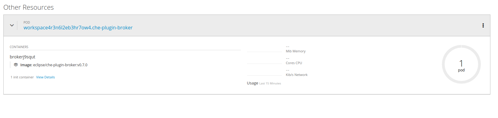

= Architectural insights about the plugin brokers

== Existing type of plugins

Before diving into the plugin broker concept let's briefly summarize which types of plugins are currently supported in Che:

* Che Editor Plugin
** provides an editor / IDE running as a sidecar e.g. Theia, Dirigible, Jupyter Notebook
* Che Plugin
** sidecar container which provides additional functionality e.g  `che-machine-exec-plugin` (provides terminal capabilities)
* VS Code extension Plugin
** sidecar container which provides functionality of an existing vscode extension e.g. https://www.sonarlint.org/vscode/(sonarlint)
* Theia Plugin
** sidecar container (can be also run in the main theia container) which extends functionality of the che-theia editor

== Plugin registry

All the existing plugins are available via the plugin registry - a standalone service which provides the plugins metadata:

.plugins.json
[source,json]
----
[
{
"id":"che-dummy-plugin","version":"0.0.1","type":"Che Plugin","name":"Che Samples Hello World Plugin","description":"A hello world theia plug-in wrapped into a Che Plug-in", "links": {"self":"/plugins/che-dummy-plugin/0.0.1/meta.yaml" }
}
,{
"id":"che-machine-exec-plugin","version":"0.0.1","type":"Che Plugin","name":"Che machine-exec Service","description":"Che Plug-in with che-machine-exec service to provide creation terminal", "links": {"self":"/plugins/che-machine-exec-plugin/0.0.1/meta.yaml" }
}
,{
"id":"che-service-plugin","version":"0.0.1","type":"Che Plugin","name":"Che Samples REST API Sidecar Plugin","description":"Che Plug-in with Theia plug-in and container definition providing a service", "links": {"self":"/plugins/che-service-plugin/0.0.1/meta.yaml" }
}
,{
"id":"org.eclipse.che.editor.dirigible","version":"1.0.0","type":"Che Editor","name":"dirigible-che-editor-plugin","description":"Eclipse Dirigible as App Development Platform for Eclipse Che", "links": {"self":"/plugins/org.eclipse.che.editor.dirigible/1.0.0/meta.yaml" }
}
,{
"id":"org.eclipse.che.editor.eclipseide","version":"0.0.1","type":"Che Editor","name":"eclipse-ide","description":"Eclipse IDE", "links": {"self":"/plugins/org.eclipse.che.editor.eclipseide/0.0.1/meta.yaml" }
}
,{
"id":"org.eclipse.che.editor.gwt","version":"1.0.0","type":"Che Editor","name":"gwt-ide","description":"Eclipse GWT IDE", "links": {"self":"/plugins/org.eclipse.che.editor.gwt/1.0.0/meta.yaml" }
}
,{
"id":"org.eclipse.che.editor.jupyter","version":"1.0.0","type":"Che Editor","name":"jupyter-notebook","description":"Jupyter Notebook as Editor for Eclipse Che", "links": {"self":"/plugins/org.eclipse.che.editor.jupyter/1.0.0/meta.yaml" }
}
,{
"id":"org.eclipse.che.editor.theia","version":"1.0.0","type":"Che Editor","name":"theia-ide","description":"Eclipse Theia", "links": {"self":"/plugins/org.eclipse.che.editor.theia/1.0.0/meta.yaml" }
}
,{
"id":"org.eclipse.che.editor.theia","version":"master","type":"Che Editor","name":"theia-ide","description":"Eclipse Theia, get the latest release each day", "links": {"self":"/plugins/org.eclipse.che.editor.theia/master/meta.yaml" }
}
,{
"id":"org.eclipse.che.samples.container-fortune","version":"0.0.1","type":"Theia plugin","name":"Che-Samples-Fortune","description":"Fortune plug-in running in its own container that provides the fortune", "links": {"self":"/plugins/org.eclipse.che.samples.container-fortune/0.0.1/meta.yaml" }
}
,{
"id":"org.eclipse.che.theia.dev","version":"0.0.1","type":"Che Plugin","name":"Che Theia Dev Plugin","description":"Che Theia Dev Plugin", "links": {"self":"/plugins/org.eclipse.che.theia.dev/0.0.1/meta.yaml" }
}
,{
"id":"org.eclipse.che.vscode-sonarlint","version":"0.0.1","type":"VS Code extension","name":"vscode-sonarlint","description":"VS Code extension that provides sonarlint features", "links": {"self":"/plugins/org.eclipse.che.vscode-sonarlint/0.0.1/meta.yaml" }
}
]
----

NOTE: https://che-plugin-registry.openshift.io is used as the default plugin registry, but it could be overriden via `CHE_WORKSPACE_PLUGIN__REGISTRY__URL` env var. Can be also set to 'NULL' in case plugin tooling are not required.

This metadata is consumed by Che sever and exposed via the User Dashboard for choosing the plugins during the workspace creation:

image::images/che-plugin-brokers/plugins.png[width="1640", height="1500",aption="Che plugins"]

During workspace creation user can select only one `Che Editor Plugin` and multiple Che, VS Code, Theia plugins.

NOTE: Che, VS Code, Theia plugin functionality depend could depend on the `Che Editor Plugin`. For example VS Code Plugin will not provide any functionality in the Jupyter Notebook. At the moment there is no smart validation of plugins based on the editor type.

More information about the plugin registry can be found in the https://github.com/eclipse/che-plugin-registry[che-plugin-registry] README.md

== Plugin brokers

Plugin boker is an application that runs just before the actual workspace start phase and based on the recieved plugin metadata deliveres the plugin binaries to the workspace containers. Taken into account that there are multiple types of plugins there are also multiple types of brokers:

* `Che Plugin Broker` for `Che Plugin` type
* `VS Code extension Broker` for `VS Code extension Plugin` type
* `Theia Plugin Broker` for `Theia Plugin` type

NOTE: Plugin broker process `Che Plugin`, `VS Code extension Plugin`, `Theia Plugin` and do not process `Che Editor Plugin` types (editor plugins are processed directly by Che server).

More details about the existing plugin brokers and how those are difer one from another can be found in the `README.MD` of the dedicated https://github.com/eclipse/che-plugin-broker[che-plugin-broker] repository.

=== Plugin broker lifecycle

=== Plugin broker activity diagramm 

image::images/che-plugin-brokers/plugin_broker_activity_diagramm.svg[width="1640", height="1640",aption="Che Plugin Broker activity diagramm"]

== What are the plugin brokers in general (why plugin brokers are needed) ?

Che has devPlugin brokers. The purpose of devPlugin brokers is to handle a specific way to install a devPlugin into Che. There are several type of devPlugins that can run on different editors and may be packaged differently. So each cases requires a specific installation.
At the moment, according to the `type` metadata of the devPlugin, Che would start the right broker and process the specific installation process.
We have these below devPlugin types and each of them has a broker implementation:

- Che-VSCode plug-in
    - Sidecar containers
    - A reference to a vscode extension (in the market place)
- Che plug-in
    - Sidecar containers
    - Editor commands
- Theia plug-in
    - A .theia file with
        - The plugin on a che-theia editor
        - Optionally sidecars container
- Editor plug-in
    - A containers with a web app (editor)
    - Sidecar containers

Each type of plugin have a corresponding broker. Broker install process for each type is describe here: https://github.com/eclipse/che-plugin-broker/blob/master/README.md 

==== Theia supports several types of plugins including VSCode extensions. It could add support of new plugin types in future
==== Since Che 7 supports plugable editor implementations we should have an ability to add broker of plugins suitable for a new editor
==== It is possible to also implement plugins for other plugins

== What plugin brokers can do and how they work ?
==== Download binaries and configuration of editors/plugins
==== Generate configuration of editors/plugins including sidecars
==== Unpack files in it is needed for them to be consumed by an editor
==== Send logs of stages of its work to Workspace master to make workspace start more verbose to show why a user waits
==== Send error if something goes wrong

== Description of existing plugin brokers from https://github.com/eclipse/che-plugin-broker/blob/master/README.md

== TODO

Documentation is supposed to be published on eclipse.org website -  https://www.eclipse.org/che/docs/che-7/index.html 

- https://bluejeans.com/s/B6Wbo
- https://docs.google.com/presentation/d/1ouN3eBbRZy10rmBEnGhx9Xrz8vNm5CSSc3nqEIzn0Nw/edit#slide=id.g49a86d12a0_0_130
- https://gist.github.com/garagatyi/edfd4e7fdeba1fdf18d9a0e2404d538d
- https://www.eclipse.org/che/docs/che-7/index.html
