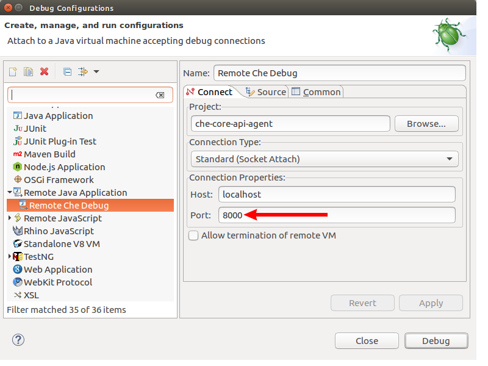

== Eclipse Che: remote debugging setup

Eclipse Che has a huge codebase and sometimes if you work on a separate component it is very convinient to have only this component imported to the IDE. Lets try to setup remote debugging for Eclipse IDE using the https://github.com/ibuziuk/che/tree/master/wsmaster[wsmaster] component as an example. First thing you need to do is building the component:

....
cd che/wsmaster
mvn clean install
....

After that you need to build Che: 

....
cd che/assembly/assembly-main
mvn clean install
....

The next step would be building the che-launcher image that is located in separate GitHub https://github.com/eclipse/che-dockerfiles[che-dockerfiles] repository:

....
cd che-dockerfiles/che-launcher
docker build -t codenvy/che-launcher .
....

The final step would be running the che-launcher with several environment variables:

|===
|Variable | Description

|CHE_DEBUG_SERVER
|The variable for enabling debug mode

|CHE_DEBUG_SERVER_PORT
|The remote debugging port

|CHE_LOCAL_BINARY
|The path to a Che assembly that is on your host to be used instead of the binary contained within the che-server image
|===

The command itself looks like this:
....
docker run -t -v /var/run/docker.sock:/var/run/docker.sock -e "CHE_DEBUG_SERVER=true" -e "CHE_DEBUG_SERVER_PORT=9999" -e "CHE_LOCAL_BINARY=/home/git/che/assembly/assembly-main/target/eclipse-che-5.0.0-M5-SNAPSHOT/eclipse-che-5.0.0-M5-SNAPSHOT" codenvy/che start
....

NOTE: `CHE_LOCAL_BINARY` path should be ammended for pointing to your che assembly

Now it is time to setup Eclipse for remote debugging. Import "wsmaster" as a Maven Project:

image::images/che-remote-debugging/eclipse_debug.png[width="740", height="400", caption="Debug"]

image::images/che-remote-debugging/remote_java_app.png[width="740", height="400", caption="Debug"]

image::images/che-remote-debugging/swagger_cropped.png[width="740", height="400", caption="Debug"]

