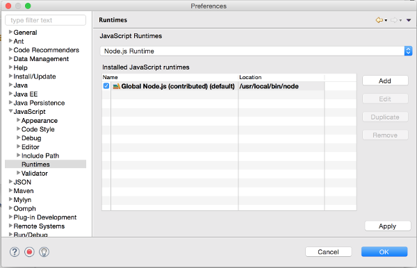

= JSDT Front-end Debugger

== How to implement Front-end Debugger support ?

There is an epic bugzilla for this task: 
 
 - https://bugs.eclipse.org/bugs/show_bug.cgi?id=486065[Bug 486065] / https://issues.jboss.org/browse/ERT-48[ERT-48] *Support Chromium based browser debugging*. 

Basically, this^ issue can be devided into two major parts: 

- *Debugger* (Everyting that is connected with Web Inspector Protocol support / parsers / source mapping etc.)

- *Using Chrome / Chromium browser As Runtime* - https://bugs.eclipse.org/bugs/show_bug.cgi?id=497765[Bug 497765]

The idea is to have smth. similar that has been already implemented for Node.js Debugger:

- Add *Chromium / Chrome Runtime* similar to *Node.js Runtime*:

- Add launch shortcut (smth. like Debug Front-End) enabled on html files (file protocol) and Server Adapters (http / https)

- Launch configuration should run *Chrome / Chromium Runtime* with `--remote-debugging-port` and `'www.example.com'` (start page parameter) + launch WIP debugger for connecting to debug port

== Potential problems

- how to detect start url if server was launched without using server adapters (Node.js app / gulp / grunt)

== Additional Information

- https://dl.dropboxusercontent.com/u/19656504/jsdt-debugger.pdf[JSDT Debugger slides] by Denis Golovin - contains information about both `Node.js` (V8) and `front-end` (WIP) debuggers